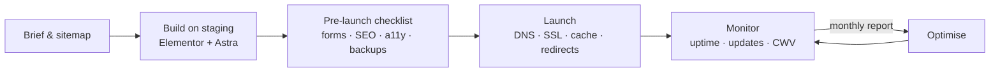

<!--
  Profile README for github.com/devkaushall
  Repo MUST be named exactly  devkaushall/devkaushall  (double L) to render on the profile.
  Design rules: one screen of signal, self-hosted assets, no rate-limited widgets,
  nothing claimed that a hiring manager can't verify by clicking.
-->

<picture>
  <source media="(prefers-color-scheme: dark)" srcset="assets/header-dark.svg">
  <source media="(prefers-color-scheme: light)" srcset="assets/header-light.svg">
  
</picture>

I build, maintain and speed up WordPress sites for small businesses — Elementor + Astra builds, LiteSpeed caching, clean lead forms, and zero-downtime maintenance. Early-career, learning in public, and allergic to invented metrics.

[Portfolio](https://dev-kaushal.netlify.app/) · [LinkedIn](https://linkedin.com/in/dev-kaushal-8215373ab) · [Live WordPress build](https://dev.digitalindiahub.com/) · [Contact](https://dev-kaushal.netlify.app/#contact)

 

## Now — updated Oct 2026

- 🔧 Running and maintaining WordPress sites: updates, backups, uptime and speed work
- 🧰 Turning my recurring tasks into **[wp-ops-toolkit](https://github.com/devkaushall/wp-ops-toolkit)** — launch checklists, maintenance runbooks, LiteSpeed presets and Elementor snippets
- 📈 Publishing before/after Core Web Vitals for every optimisation I do, so the numbers speak instead of me

 

## What I do

<!-- EDIT ME: the second row lists tools I inferred from your sites (Elementor, Astra, LiteSpeed confirmed).
     Replace anything you don't actually use (e.g. cPanel/hPanel, Cloudflare, UpdraftPlus) — only list what you can talk about in an interview. -->
| Build | Maintain | Optimise |
| :--- | :--- | :--- |
| Elementor & Astra sites, WooCommerce stores, landing pages | Core/plugin/theme updates, backups & restores, staging → production, uptime monitoring | LiteSpeed Cache tuning, image & font delivery, Core Web Vitals, on-page & technical SEO |
| `WordPress` `Elementor` `Astra` `WooCommerce` `HTML/CSS` `Tailwind` | `LiteSpeed` `cPanel/hPanel` `Cloudflare` `UpdraftPlus` `Netlify` | `PageSpeed Insights` `Search Console` `GA4` `Schema.org` |

 

## Selected work

| Project | What it is · who it's for | Proof |
| :--- | :--- | :--- |
| **[portfolio](https://github.com/devkaushall/portfolio)** | My "command centre" site, built as a dependency-free static generator with a Playwright QA suite and an axe-core WCAG 2.1 audit across 16 pages × 2 viewports. The same content also runs on WordPress. | [Netlify](https://dev-kaushal.netlify.app/) · [WordPress](https://dev.digitalindiahub.com/) |
| **[wp-ops-toolkit](https://github.com/devkaushall/wp-ops-toolkit)** | Checklists, snippets and configs I actually use when launching and maintaining client WordPress sites. For solo freelancers and small agencies. | README |
| **[awesome-ai-marketing](https://github.com/devkaushall/awesome-ai-marketing)** | Curated AI tools, prompts and workflows for SEO, content and marketing ops. |  |
| **[insta-page-optimising-skill](https://github.com/devkaushall/insta-page-optimising-skill)** | A platform-independent AI skill that audits an Instagram profile and returns a 15-section growth plan, with adapters for ChatGPT, Claude and Gemini. | [worked example](https://github.com/devkaushall/insta-page-optimising-skill/tree/main/examples) |
| **[luxury-ui-lab](https://github.com/devkaushall/dev_vault)** | Zero-radius design tokens and the Diavo Jewels e-commerce front-end experiment. | HTML · Tailwind |

 

## How I run a site

 

## Availability

Open to **WordPress / web operations roles** (in-house or agency, Delhi NCR or remote) and to maintenance & speed-optimisation projects.
Fastest route: the [contact form](https://dev-kaushal.netlify.app/#contact) or [LinkedIn](https://linkedin.com/in/dev-kaushal-8215373ab).

No invented clients, revenue or rankings anywhere on this profile. If a number isn't linked to its source, it isn't here.
