<!--
  CONSOLE-STYLE PROFILE README — github.com/devkaushall
  Repo must be named  devkaushall/devkaushall.
  All visuals are self-hosted SVGs in ./assets (generated by build-assets.py).
  GitHub strips CSS/JS, so "interaction" = <details> blocks + animated SVGs.
-->

<a href="https://dev-kaushal.netlify.app/"></a>

<p align="center">
  <a href="https://wa.me/918923162439"></a>
  <a href="https://linkedin.com/in/dev-kaushal-8215373ab"></a>
  <a href="https://dev-kaushal.netlify.app/"></a>
  <a href="https://dev.digitalindiahub.com/"></a>
</p>

Practical WordPress & Web Operations Specialist based in Gurugram. I build responsive, high-converting property and business sites on Elementor from a blank canvas, tune site speed with LiteSpeed Cache, and perform emergency file recoveries when updates break production.

<br>


### Hostinger hPanel Disaster Recovery

When an AI-generated plugin or an untested update throws a PHP fatal, WordPress white-screens. Rather than waiting or panicking, this is the exact manual routine I run in the hPanel File Manager to restore uptime:



<details>
<summary><b>▶ &nbsp;PURGE &amp; RECOVER</b> &nbsp;<sub>— click to run the drill</sub></summary>
<br>

```text
01  hPanel → Files → File Manager → public_html/wp-content/plugins/
02  Identify the directory that changed last (sort by Modified)        → experimental-ai-plugin/
03  Rename it first:  experimental-ai-plugin  →  experimental-ai-plugin.off   (reversible)
04  Reload the front end. 200 OK?  → the culprit is confirmed.
05  Delete the renamed folder. Database untouched — WP simply deactivates the missing plugin.
06  Purge LiteSpeed cache → re-check home, a listing page, and the contact form.
07  Log it: what broke, when, what fixed it. Then stage before the next update.
```



🎉 **DRILL COMPLETE** — uptime restored without touching the database.

</details>

<br>


### AI-Assisted Elementor CSS Engine <sub><sup>ZERO FLUFF · TARGETED SELECTORS</sup></sub>

I don't write complex stylesheets from memory — I prompt Claude/ChatGPT for precise selectors and inject them into Elementor's **Advanced → Custom CSS** panel to tune buttons, hover states and spacing.

<details>
<summary><b>▶ &nbsp;OPEN LIVE INJECTOR</b> &nbsp;<sub>— Cyber Cyan · Verified Green · Property Gold</sub></summary>
<br>

```css
/* Prompt: "clean glowing action trigger for a real-estate lead button" */
selector .lead-button {
  background: #00f0ff;                           /* Cyber Cyan   → #00ff88 Verified Green → #ffb703 Property Gold */
  color: #04070b;
  border-radius: 8px;
  box-shadow: 0 0 20px rgba(0, 240, 255, 0.4);
  transition: all 0.3s ease;
}
selector .lead-button:hover {
  transform: translateY(-2px);
  box-shadow: 0 0 32px rgba(0, 240, 255, 0.6);
}
```

Rendered component → **`Inquire on WhatsApp ➔`** — swap the two hex values to switch theme; nothing else changes.

</details>

<br>


### Missions & Practical Projects <sub><sup>VERIFIED CAPSTONES @ SKILLUP GRADED</sup></sub>

<p align="center">
  
  
  
</p>

<br>


### Live Speed Architecture

<a href="https://pagespeed.web.dev/analysis?url=https%3A%2F%2Fdev.digitalindiahub.com%2F"></a>

<br>


| BUILD | MAINTAIN | OPTIMISE |
| :--- | :--- | :--- |
| `WordPress` `Elementor` `Astra` `Hello Elementor` `WooCommerce` | `Hostinger hPanel` `File Manager recovery` `Backups & restores` `Updates & staging` | `LiteSpeed Cache` `WebP delivery` `Deferred JS` `On-page SEO` `Search Console` |

<br>


| Issuer | Credential | Verification |
| :--- | :--- | :--- |
| Google Digital Garage | Fundamentals of Digital Marketing | `ID: 449277253` |
| HubSpot Academy | Social Media Marketing II | Verified academy badge |
| Canva Design School | Canva Essentials & Graphic Design | Certified |
| Anthropic Academy | Claude 101 — AI Prompting | Prompt engineering foundations |
| CSJM University, Kanpur | B.Com — Terms 1–4 clear | Currently pursuing |

<br>


### Ready for Full-Time & Project Deployments

Available for an entry-level **WordPress Executive**, **Web Support Specialist** or **Site Maintenance Associate** role in Gurugram / Delhi NCR / Remote.

<p>
  <a href="https://wa.me/918923162439"></a>
  <a href="https://linkedin.com/in/dev-kaushal-8215373ab"></a>
  <a href="https://dev-kaushal.netlify.app/"></a>
  <a href="mailto:REPLACE@EMAIL.COM"></a>
</p>

<p align="center"><sub><code>DEV KAUSHAL · WORDPRESS & WEB OPERATIONS SPECIALIST · GURUGRAM (DELHI NCR)</code><br><code>AUTHENTIC WORKFLOW CONSOLE · REAL-WORLD INTEGRITY · NO FLUFF ARCHITECTURE</code></sub></p>
